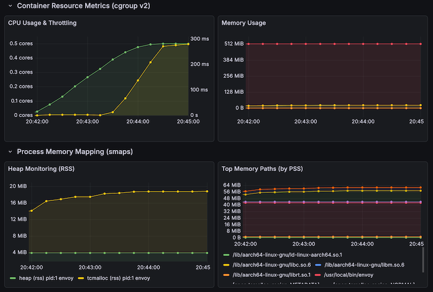

# Contour and Envoy Monitoring Example

This example demonstrates how to monitor Contour and Envoy using `container-resource-exporter`.



## Prerequisites

- [Kind](https://kind.sigs.k8s.io/)
- [kubectl](https://kubernetes.io/docs/tasks/tools/)

## Deployment Steps

Create a Kind Cluster

```bash
kind create cluster --config configs/kind.yaml --name container-resource-exporter
```

Run the [setup.sh](setup.sh) script to deploy Contour, Envoy, and the observability stack (Prometheus, Grafana, and the exporter).


```bash
./setup.sh
```


## Generating Load and Observing Metrics

Once all pods are running, you can access the following services:

- **Grafana**: [http://localhost:3000/](http://localhost:3000/)
  - Click "Dashboards" > "Contour & Envoy Observability" to view the dashboard.
  - Pick Contour or Envoy pod from the Pod dropdown to see metrics for that specific pod.
- **Echoserver**: [http://echoserver.127.0.0.1.nip.io/](http://echoserver.127.0.0.1.nip.io/)
  - Makes an HTTP request to the [`echoserver`](https://github.com/tsaarni/echoserver) workload through Envoy, which is monitored by the exporter.

To see the metrics in action, generate some traffic using the [`echoclient`](https://github.com/tsaarni/echoclient) tool:

```bash
go run github.com/tsaarni/echoclient/cmd/echoclient@latest get -url http://echoserver.127.0.0.1.nip.io/ -concurrency 50 -duration 400s -rps 4000 -ramp-up-period 120s
```

## Accessing Metrics in Testing

You can use `container-resource-exporter` metrics in CI/CD pipelines to detect resource usage regressions when deploying new software versions.

1. Reset the peak memory metric by restarting the pod
2. Run your test that exercises the system under test
3. Capture peak memory, total CPU usage and throttling metrics
4. Compare against baseline values from previous versions to detect major changes

In the demo deployment, the following endpoint exposes the metrics:

- **container-resource-exporter**: [http://localhost:8080/metrics](http://localhost:8080/metrics) (see [METRICS.md](/METRICS.md))

Example Python script:

```python
from urllib.request import urlopen
import re

# Get metrics from exporter
metrics = urlopen('http://localhost:8080/metrics').read().decode()

# Extract peak memory (since container start)
peak_mem = float(re.search(r'cgroup_memory_peak_bytes{container="envoy"[^}]*} (\S+)', metrics).group(1))

# Extract memory limit
mem_limit = float(re.search(r'cgroup_memory_max_bytes{container="envoy"[^}]*} (\S+)', metrics).group(1))

# Extract CPU and throttling metrics (since container start)
# Note: For test-specific measurements, capture before/after and compute delta.
cpu_total = float(re.search(r'cgroup_cpu_usage_seconds_total{container="envoy"[^}]*} (\S+)', metrics).group(1))
nr_periods = float(re.search(r'cgroup_cpu_nr_periods_total{container="envoy"[^}]*} (\S+)', metrics).group(1))
nr_throttled = float(re.search(r'cgroup_cpu_nr_throttled_total{container="envoy"[^}]*} (\S+)', metrics).group(1))

# Calculate derived values
peak_mem_mb = f"{peak_mem / 1024**2:.1f} MB"
mem_limit_str = f"{mem_limit/1024**2:.1f} MB" if mem_limit > 0 and mem_limit < 2**63 else "unlimited"
mem_usage_str = f"{(peak_mem / mem_limit) * 100:.1f}% of limit" if mem_limit > 0 and mem_limit < 2**63 else "N/A (no limit set)"
cpu_total_str = f"{cpu_total:.2f} seconds"
throttle_str = f"{100 * nr_throttled / nr_periods if nr_periods > 0 else 0:.1f}%"

print(f"""Peak Memory: {peak_mem_mb}
Memory Limit: {mem_limit_str}
Memory Usage: {mem_usage_str}
Total CPU Time: {cpu_total_str}
Throttling %: {throttle_str}""")
```

Output example:

```
Peak Memory: 33.5 MB
Memory Limit: 512.0 MB
Memory Usage: 6.5% of limit
Total CPU Time: 137.29 seconds
Throttling %: 57.1%
```
