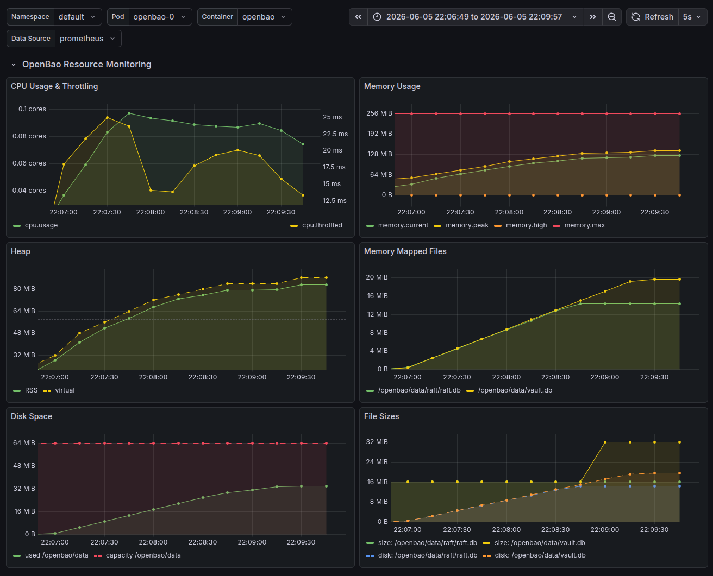

# OpenBao Monitoring Example

This example demonstrates how to monitor [OpenBao](https://openbao.org/) using `container-resource-exporter`.



## Prerequisites

- [Kind](https://kind.sigs.k8s.io/)
- [kubectl](https://kubernetes.io/docs/tasks/tools/)
- [Go](https://go.dev/)

The environment will use `go run` to execute [`certyaml`](https://github.com/tsaarni/certyaml), [`raft-inspector`](https://github.com/tsaarni/raft-inspector/) and the tools in the [`tools`](tools) directory.

## Deployment

Run the [setup.sh](setup.sh) script to create the Kind cluster and deploy OpenBao with the full observability stack (Prometheus, Grafana, and the exporter). The script also initializes and unseals the cluster automatically.

```bash
./setup.sh
```

## Host Port Mappings

The following services are exposed on the host after setup:

- **Grafana**: [http://localhost:3000/](http://localhost:3000/)
- **Prometheus**: [http://localhost:9090/](http://localhost:9090/)
- **container-resource-exporter**: [http://localhost:8080/metrics](http://localhost:8080/metrics)
- **OpenBao (openbao-0)**: `https://localhost:8200`
- **OpenBao (openbao-1)**: `https://localhost:8201`
- **OpenBao (openbao-2)**: `https://localhost:8202`

## Interacting with OpenBao

The root token and unseal keys are stored in `init.json` after running the setup script.
You can use `bao` CLI or REST API to interact with the cluster, for example:

```bash
export BAO_TOKEN=$(jq -r '.root_token' init.json)
export BAO_CACERT=$PWD/certs/ca.pem
bao operator members
```

The [`tools`](tools) directory contains additional tools to interact with OpenBao, such as a traffic generator that simulates load.
For example, to write 1000 secrets to the `kv1` engine, run:

```bash
go run -C tools . kv-write --count=1000
```

To see all the sub-commands available in the tools, run:

```bash
go run -C tools . --help
```

If you are using an LLM agent, point it to [`AGENTS.md`](AGENTS.md) to use the environment as an interactive playground to test and learn about OpenBao.

## Cleanup

```bash
kind delete cluster --name openbao
```
